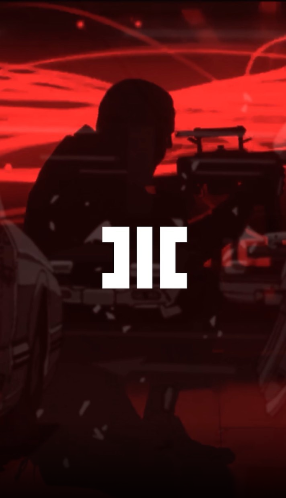

# MOTHNODE_ Bullseye

**Listen now:** 

## Project Data

Recorded completely raw on a phone mic with no effects whatsoever since my laptop is dead. Theme: sniper on the rooftop of the mind gunning down bad habits. This time a bit of a mashup of AMV - might be interesting to introduce Animatrix style animation into the storyworld of Hitech Crime. What do you think? Leave a comment!

**Title:** Bullseye / **Featuring:** MOTHNODE

**Production:** Apollo Young  / **Lyrics:** MOTHNODE

**Narrative Design:**

**Music Video Credits:**

## Lyrics

```
“mothnode connected”
“sir, setup is ready”

[WHISPER] 
from the streets to the tops
view’s clouded with a long drop
windows break like souls
reflected was it worth a shot
through a glimpse to a height
another height next step
could mean certain...

[CHORUS]

from the streets to the tops
view’s clouded with a long drop
windows break like souls
reflected was it worth a shot
through a glimpse to a height
another height next step
could mean certain death or not

from the streets to the tops
view’s clouded with a long drop

windows break like souls
reflected was it worth a shot
was it worth a shot, nah

through a glimpse to a height
another height next step
could mean certain death or not

through a glimpse to a height
another height next step
could mean certain death or not

[VERSE1]

ya it is over

xxx

would it kill you to say no

xxx

would it kill you to say no
would it kill you to say no
would it kill you to say no

pow pow pow

[WHISPER]
from the streets to the tops
view’s clouded with a long drop
windows break like souls
reflected was it worth a shot
through a glimpse to a height
another height next step
could mean certain...

[CHORUS]
from the streets to the tops
view’s clouded with a long drop
windows break like souls
reflected was it worth a shot
through a glimpse to a height
another height next step
could mean certain death or not

from the streets to the tops
view’s clouded with a long drop
windows break like souls
reflected was it worth a shot
was it worth a shot, nah

through a glimpse to a height
another height next step
could mean certain death or not

through a glimpse to a height
another height next step
could mean certain death or not

[VERSE2]

took through the city to an upward draft
like stepping into a blindspot
take your connection to a naught
yeah

no matter (don't mind) what they say
listen to what I say
what did I say?

took through the city to an upward draft
smoking huge blunts
taking to another time

from the streets to the tops
view’s clouded with a long drop
yeah


“mission complete”

```

## Lyrics Testing Ground

16bar - verse

*italics* run in
**bold**

| x | 1 | 2 | 3 | 4 |
|---|---|---|---|---|
| 1 | *i'm in a* **fast** food | **joint** and i just  | **or**dered a  | **la**tte  |
| 2 | *the* **ca**shier | **tu**rns away  |  **con**veying what |  **i** placed |
| 3 | *i'm* **tempt**ed in a | **u**nique way  |  **you** probably |  **won't** think |
| 4 | *as i* **reach** to grab the |  **mic** i contem-  | **plate** what i | **might** say |

## Notes

## Music Video
